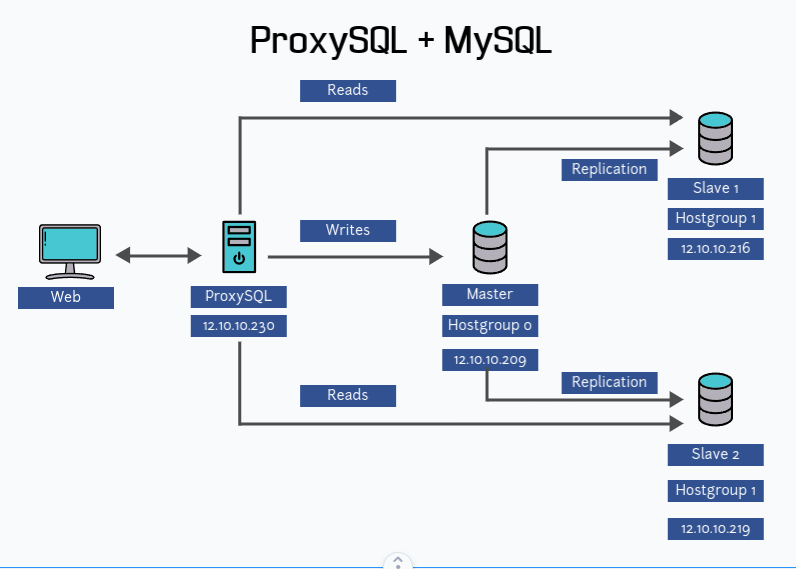
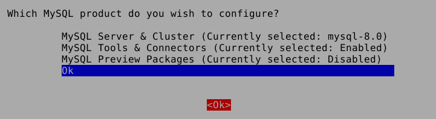

# Tutorial para criar uma solução de alta disponibilidade com MySQL, InnoDB e ProxySQL no Debian 11

[](https://travis-ci.org/joemccann/dillinger)

## Diagrama Usado:

___
## Pré-requisitos
- 04 servidores Debian 11 com acesso à internet.
- Sendo:
    - 01 = ProxySQL
    - 01 = MySQL Master (Escrita no Banco)
    - 02 = MySQL Slave (Leitura no Banco)
___
## Passo a passo

0. Preparação:
    - Instale o Debian 11 nos servidores diferentes.
    - Atualize as informações de pacote:
    ```sh
    sudo apt update && sudo timedatectl set-timezone America/Sao_Paulo && sudo apt update && sudo apt upgrade -y && sudo apt install curl net-tools software-properties-common acl unzip htop ncdu locales locales-all -y install software-properties-common wget gnupg ufw -y
    ```
    > Proxmox use isso:
    > ```sh
    >apt update && timedatectl set-timezone America/Sao_Paulo && apt update && apt upgrade -y && apt install curl net-tools software-properties-common acl unzip htop ncdu locales locales-all wget gnupg ufw -y
    >```

1. Configurando o MASTER:

    - Após Executar o Passo 0.

    - Configurando UFW:
        - Adicione regras UFW:
            ```sh
            ufw enable && ufw allow from 12.10.10.0/24 && ufw status
            ```

    - Instalação do MySQL:
        - Adicione o repositório do MySQL ao sistema:
        ```sh
        wget https://repo.mysql.com//mysql-apt-config_0.8.24-1_all.deb && sudo dpkg -i mysql-apt-config_0.8.24-1_all.deb && sudo apt update
        ```
        > Proxmox use isso:
        > ```sh
        >wget https://repo.mysql.com//mysql-apt-config_0.8.24-1_all.deb && dpkg -i mysql-apt-config_0.8.24-1_all.deb && apt update
        >```

        - Configuração Padrão:
        
        - Instale o MySQL no Debian 11:
        ```sh
        sudo apt install mysql-server -y && mysql_secure_installation
        ```
        > Proxmox use isso:
        > ```sh
        >apt install mysql-server -y && mysql_secure_installation
        >```

        - Verifique se o MySQL está rodando:
        ```sh
        sudo systemctl status mysql
        ```
        > Proxmox use isso:
        > ```sh
        >systemctl status mysql
        >```
        
    - Configuração do MySQL:

        - Configure o arquivo de configuração do MySQL para permitir o acesso remoto:
            ```sh
            sudo nano /etc/mysql/mysql.conf.d/mysqld.cnf
            ```
            > Proxmox use isso:
            > ```sh
            >nano /etc/mysql/mysql.conf.d/mysqld.cnf
            >```

            - Adicione as seguintes linhas:
            ```nano
            [mysqld]

            default-storage-engine = InnoDB
            bind-address = 0.0.0.0
            server-id = 1
            log_bin = /var/log/mysql/mysql-bin.log
            max_binlog_size = 500M
            ```

            - Reinicie o MySQL:
            ```sh
            sudo systemctl restart mysql && sudo systemctl status mysql
            ```
            > Proxmox use isso:
            > ```sh
            >systemctl restart mysql && systemctl status mysql
            >```

        - Criando os usuários:
            - Acesse o console do MySQL:
            ```sh
            mysql -u root -p
            ```
            - Configurando usuário slave:
            ```sh
            mysql> create user 'user-slave-1'@'12.10.10.216' IDENTIFIED WITH mysql_native_password by 'strong-pass';

            mysql> create user 'user-slave-2'@'12.10.10.229' IDENTIFIED WITH mysql_native_password by 'strong-pass';

            mysql> GRANT REPLICATION SLAVE ON *.* TO 'user-slave-1'@'12.10.10.216';

            mysql> GRANT REPLICATION SLAVE ON *.* TO 'user-slave-2'@'12.10.10.229';
            mysql> FLUSH PRIVILEGES;
___

2. Configurando SLAVE 1:

    - Após Executar o Passo 0.

    - Configurando UFW:
        - Adicione regras UFW:
            ```sh
            ufw enable && ufw allow from 12.10.10.0/24 && ufw status
            ```
    - Instalação do MySQL:

        - Adicione o repositório do MySQL ao sistema:
        ```sh
        wget https://repo.mysql.com//mysql-apt-config_0.8.24-1_all.deb && sudo dpkg -i mysql-apt-config_0.8.24-1_all.deb && sudo apt update
        ```
        > Proxmox use isso:
        > ```sh
        >wget https://repo.mysql.com//mysql-apt-config_0.8.24-1_all.deb && dpkg -i mysql-apt-config_0.8.24-1_all.deb && apt update
        >```

        - Configuração Padrão:
        
        - Instale o MySQL no Debian 11:
        ```sh
        sudo apt install mysql-server -y && mysql_secure_installation
        ```
        > Proxmox use isso:
        > ```sh
        >apt install mysql-server -y && mysql_secure_installation
        >```

        - Verifique se o MySQL está rodando:
        ```sh
        sudo systemctl status mysql
        ```
        > Proxmox use isso:
        > ```sh
        >systemctl status mysql
        >```

    - Configure o arquivo de configuração do MySQL slave 1:
        ```sh
        sudo nano /etc/mysql/mysql.conf.d/mysqld.cnf
        ```
        - Adicione as seguintes linhas:
        ```nano
        [mysqld]

        default-storage-engine = InnoDB
        bind-address = 0.0.0.0
        server-id = 2
        read_only = 1
        log_bin = /var/log/mysql/mysql-bin.log
        max_binlog_size = 500M
        ```

        - Reinicie o MySQL:
        ```sh
        sudo systemctl restart mysql && sudo systemctl status mysql
        ```
        > Proxmox use isso:
        > ```sh
        >systemctl restart mysql && systemctl status mysql
        >```

    - Configure replicação:

         - Acesse o console do MySQL:
        ```sh
        mysql -u root -p
        ```

        - Coletando Info do Server:
        ```sh
        mysql> SHOW MASTER STATUS;
        ```

        - Saida:
        ```sh
        *************************** 1. row ***************************
        File: mysql-bin.000002
        Position: 1047
        Binlog_Do_DB: 
        Binlog_Ignore_DB: 
        Executed_Gtid_Set: 
        1 row in set (0.00 sec)
        ```

        - Configure o usuário e a senha para o acesso remoto ao MySQL:
        ```sh
        mysql> CHANGE MASTER TO
            MASTER_HOST='12.10.10.209',
            MASTER_USER='user-slave-1',
            MASTER_PASSWORD='passwd-user-slave-1',
            MASTER_PORT=3306,
            MASTER_LOG_FILE='mysql-bin.000002',
            MASTER_LOG_POS=1047,
            MASTER_CONNECT_RETRY=10;
        ```

        - Iniciando Copia para o Slave:
        ```sh
        mysql> START SLAVE;
        ```

        - Verificando Status:
        ```sh
        mysql> SHOW SLAVE STATUS\G;
        ```

        - Saida:
        ```sh
        *************************** 1. row ***************************
                Slave_IO_State: Waiting for master to send event
                    Master_Host: 12.10.10.209
                    Master_User: user-slave-1
                    Master_Port: 3306
                Connect_Retry: 60
                Master_Log_File: mysql-bin.000002
            Read_Master_Log_Pos: 1047
                Relay_Log_File: slave-relay-bin.000002
                Relay_Log_Pos: 324
        Relay_Master_Log_File: mysql-bin.000002
                Slave_IO_Running: Yes
            Slave_SQL_Running: Yes
        ```
___

3. Configurando SLAVE 2:

    - Após Executar o Passo 0.

    - Configurando UFW:
        - Adicione regras UFW:
            ```sh
            ufw enable && ufw allow from 12.10.10.0/24 && ufw status
            ```
    - Instalação do MySQL:

        - Adicione o repositório do MySQL ao sistema:
        ```sh
        wget https://repo.mysql.com//mysql-apt-config_0.8.24-1_all.deb && sudo dpkg -i mysql-apt-config_0.8.24-1_all.deb && sudo apt update
        ```
        > Proxmox use isso:
        > ```sh
        >wget https://repo.mysql.com//mysql-apt-config_0.8.24-1_all.deb && dpkg -i mysql-apt-config_0.8.24-1_all.deb && apt update
        >```

        - Configuração Padrão:
        
        - Instale o MySQL no Debian 11:
        ```sh
        sudo apt install mysql-server -y && mysql_secure_installation
        ```
        > Proxmox use isso:
        > ```sh
        >apt install mysql-server -y && mysql_secure_installation
        >```

        - Verifique se o MySQL está rodando:
        ```sh
        sudo systemctl status mysql
        ```
        > Proxmox use isso:
        > ```sh
        >systemctl status mysql
        >```

    - Configure o arquivo de configuração do MySQL slave 1:
        ```sh
        sudo nano /etc/mysql/mysql.conf.d/mysqld.cnf
        ```
        - Adicione as seguintes linhas:
        ```nano
        [mysqld]

        default-storage-engine = InnoDB
        bind-address = 0.0.0.0
        server-id = 3
        read_only = 1
        log_bin = /var/log/mysql/mysql-bin.log
        max_binlog_size = 500M
        ```

        - Reinicie o MySQL:
        ```sh
        sudo systemctl restart mysql && sudo systemctl status mysql
        ```
        > Proxmox use isso:
        > ```sh
        >systemctl restart mysql && systemctl status mysql
        >```

    - Configure replicação:

         - Acesse o console do MySQL:
        ```sh
        mysql -u root -p
        ```

        - Coletando Info do Server:
        ```sh
        mysql> SHOW MASTER STATUS;
        ```

        - Saida:
        ```sh
        *************************** 1. row ***************************
        File: mysql-bin.000003
        Position: 115
        Binlog_Do_DB: 
        Binlog_Ignore_DB: 
        Executed_Gtid_Set: 
        1 row in set (0.00 sec)
        ```

        - Configure o usuário e a senha para o acesso remoto ao MySQL:
        ```sh
        mysql> CHANGE MASTER TO
            MASTER_HOST='12.10.10.209',
            MASTER_USER='user-slave-2',
            MASTER_PASSWORD='passwd-user-slave-2',
            MASTER_PORT=3306,
            MASTER_LOG_FILE='mysql-bin.000003',
            MASTER_LOG_POS=115,
            MASTER_CONNECT_RETRY=10;
        ```

        - Iniciando Copia para o Slave:
        ```sh
        mysql> START SLAVE;
        ```

        - Verificando Status:
        ```sh
        mysql> SHOW SLAVE STATUS\G;
        ```

        - Saida:
        ```sh
        *************************** 1. row ***************************
                Slave_IO_State: Waiting for master to send event
                    Master_Host: 12.10.10.209
                    Master_User: user-slave-2
                    Master_Port: 3306
                Connect_Retry: 60
                Master_Log_File: mysql-bin.000003
            Read_Master_Log_Pos: 115
                Relay_Log_File: slave-relay-bin.000003
                Relay_Log_Pos: 324
        Relay_Master_Log_File: mysql-bin.000003
                Slave_IO_Running: Yes
            Slave_SQL_Running: Yes
        ```
___

>>> VALIDADO ATE AQUI

4. Instalação do ProxySQL:


    - Adicione o repositório do ProxySQL ao seu sistema:
    ```sh
    sudo echo "deb https://repo.proxysql.com/ProxySQL/proxysql-2.4.x/Debian/ bullseye main" >> /etc/apt/sources.list && sudo apt-key adv --keyserver keys.gnupg.net --recv-keys 5072E1F5
    ```
    > Proxmox use isso:
    > ```sh
    > echo "deb https://repo.proxysql.com/ProxySQL/proxysql-2.4.x/Debian/ bullseye main" >> /etc/apt/sources.list && apt-key adv --keyserver keys.gnupg.net --recv-keys 5072E1F5
    >```

    - Atualize a lista de pacotes:
    ```sh
    sudo apt update
    ```
    > Proxmox use isso:
    > ```sh
    >apt update
    >```

    - Instale o ProxySQL:
    ```sh
    sudo apt install proxysql
    ```
    > Proxmox use isso:
    > ```sh
    >apt install proxysql
    >```

6. Configure o ProxySQL: 
    - Configure o ProxySQL para apontar para o seu servidor principal e secundário:
    ```sh
    sudo nano /etc/proxysql.cnf
    ```
    > Proxmox use isso:
    > ```sh
    >nano /etc/proxysql.cnf
    >```

    - Adicione as seguintes linhas:
    ```nano
    [mysql_servers]
    hostgroup_id=10
    hostname=<endereço IP do servidor principal>
    port=3306
    status=ON
    weight=1

    hostgroup_id=20
    hostname=<endereço IP do servidor secundário>
    port=3306
    status=ON
    weight=2
    ```

    - Reinicie o ProxySQL:
    ```sh
    sudo systemctl restart proxysql
    ```
    > Proxmox use isso:
    > ```sh
    >systemctl restart proxysql
    >```
___
7. Verificação da configuração:
    - Verifique o status do ProxySQL:
    ```sh
    sudo systemctl status proxysql
    ```
    > Proxmox use isso:
    > ```sh
    >systemctl status proxysql
    >```

    - Acesse o console do ProxySQL:
    ```sh
    mysql -u admin -padmin -h 127.0.0.1 -P6032
    ```

    - Verifique se o ProxySQL está apontando para o servidor principal e secundário:
    ```sh
    SELECT hostgroup_id, hostname, port, status, weight FROM mysql_servers;
    ```
___

> Com esses passos, você deve ter uma solução de alta disponibilidade com MySQL, InnoDB e ProxySQL configurada no seu Debian 11. Certifique-se de testar sua configuração antes de colocá-la em produção.
>
>A conexão com o banco de dados é feita através do ProxySQL da mesma forma que seria feita com um banco de dados diretamente. Você precisa especificar o endereço IP e a porta do ProxySQL como seu host de banco de dados e a porta 3306 (padrão para o MySQL). Além disso, você precisa fornecer o nome de usuário e a senha para autenticação no banco de dados.
___

>Aqui está um exemplo de como realizar a conexão ao banco de dados através do ProxySQL em PHP:
```php
    <?php
    $host = "127.0.0.1";
    $port = 3306;
    $user = "username";
    $password = "password";
    $dbname = "database_name";

    // Cria uma nova conexão
    $conn = new mysqli($host, $user, $password, $dbname, $port);

    // Verifica se a conexão foi bem-sucedida
    if ($conn->connect_error) {
        die("A conexão falhou: " . $conn->connect_error);
    }
    echo "Conexão realizada com sucesso.";
    ?>
```
